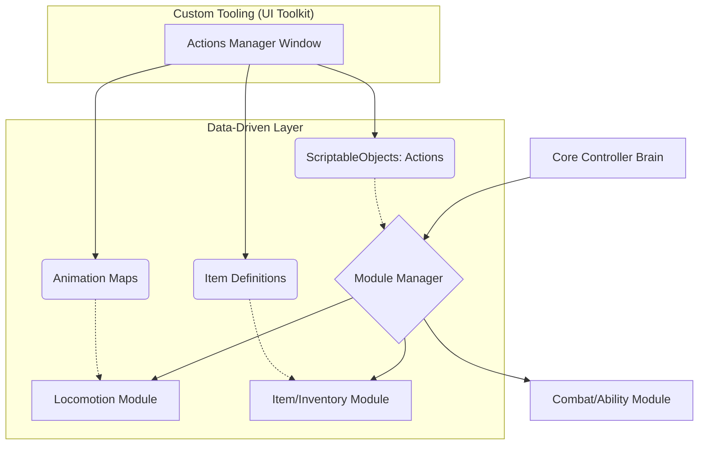

# 🎮 Ultimate Controller | Modular Gameplay Framework


**Ultimate Controller** is a high-performance, modular 3D character system designed for scalability and developer productivity. Moving away from rigid, "all-in-one" controllers, this framework uses a **decoupled, data-driven architecture** that allows developers to compose unique character behaviors through interchangeable modules and custom editor tools.

---

## 🏗️ System Architecture

The framework is built on the principle of **Composition over Inheritance**. A central "Brain" coordinates multiple independent modules that communicate through a robust event system.

### Modular Ecosystem Flow
This diagram shows how dynamic components integrate without tight coupling:



## 🚀 Installation
Unity Package Manager
This framework is structured as a native UPM Package. To install it, open the Unity Package Manager, select "Install package from git URL," and paste the following link:
```link
git@github.com:Jisas/UltimateController.git?path=/Packages/com.jisas.ultimatecontroller
```

## 🛠️ Advanced Authoring Tools (Tooling)
A core strength of this project is its custom editor suite. Developed using Unity UI Toolkit, these tools eliminate technical friction for designers:
- Actions Manager: A dedicated window to create, chain, and debug gameplay actions without touching code.
- Item Manager: A visual interface for defining item properties, prefabs, and interaction logic.
- Locomotion Maps: An abstraction layer for animation states, allowing procedural mapping of movement data to the animator.

## 🔧 Technical Highlights
Decoupled Input: Full support for the New Input System, enabling seamless switching between Gamepad and KBM.
- State Machine Pattern (FSM): Movement and combat states are managed by a robust FSM to ensure animation fidelity and prevent state-leaking bugs.
- Custom Property Drawers: Extensive use of C# Attributes to create a clean, intuitive Inspector experience for non-technical users.
- UPM Ready: Clean separation of Runtime and Editor assemblies, optimized for assembly definition (AsmDef) compilation speeds.

## 📂 Package Structure
- /Runtime: Core logic engines (Locomotion, Inventory, Combat).
- /Editor: UI Toolkit windows (ActionsManagerWindow, ItemManagerWindow) and USS/UXML styling.
- /Documentation~: Integration guides and API references.
- /Samples: Ready-to-use character presets and example scenes.

## 👨‍💻 Author
<div aling="left">  
  <h4>Jesús Carrero - Unity Gameplay Engineer</h1>
  <a href="https://jesuscarrero.netlify.app/">
    
  </a>
</div>
